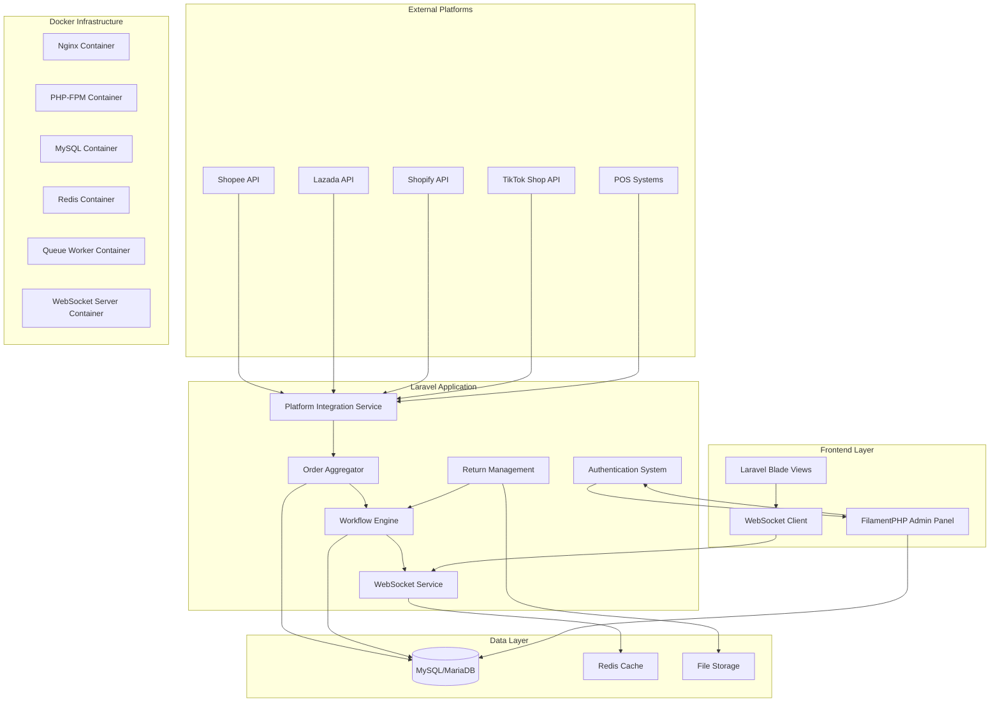

# Design Document

## Overview

The Multi-Platform Order Management System is a Laravel-based application that centralizes order processing from multiple e-commerce platforms (Shopee, Lazada, Shopify, TikTok) with real-time WebSocket communication, FilamentPHP administrative interface, and a flexible workflow engine for custom business processes. The system uses MySQL/MariaDB for data persistence and provides comprehensive order lifecycle management from acceptance to fulfillment and returns.

## Architecture

### System Architecture



### Technology Stack

- **Backend Framework**: Laravel 12
- **Database**: MySQL/MariaDB
- **Cache**: Redis
- **Admin Interface**: FilamentPHP v4
- **Real-time Communication**: Laravel WebSockets / Pusher
- **Frontend**: Laravel Blade with Alpine.js
- **Queue System**: Laravel Queues with Redis driver
- **File Storage**: Laravel Storage (local/S3)
- **Containerization**: Docker with Docker Compose
- **Web Server**: Nginx (containerized)
- **Process Manager**: Supervisor (for queues and WebSocket server)

## Components and Interfaces

### 1. Platform Integration Service

**Purpose**: Manages connections and data synchronization with external e-commerce platforms.

**Key Classes**:
- `PlatformConnector` (Abstract base class)
- `ShopeeConnector extends PlatformConnector`
- `LazadaConnector extends PlatformConnector`
- `ShopifyConnector extends PlatformConnector`
- `TikTokConnector extends PlatformConnector`
- `PlatformCredentialManager`

**Interfaces**:
```php
interface PlatformConnectorInterface
{
    public function authenticate(array $credentials): bool;
    public function fetchOrders(Carbon $since = null): Collection;
    public function updateOrderStatus(string $orderId, string $status): bool;
    public function validateCredentials(array $credentials): bool;
}
```

### 2. Order Aggregator

**Purpose**: Normalizes and consolidates orders from different platforms into a unified format.

**Key Classes**:
- `OrderAggregator`
- `OrderNormalizer`
- `OrderSyncManager`
- `PlatformOrderMapper`

**Core Methods**:
- `aggregateOrders()`: Fetches and processes orders from all platforms
- `normalizeOrder()`: Converts platform-specific order format to unified structure
- `detectDuplicates()`: Identifies potential duplicate orders across platforms

### 3. Workflow Engine

**Purpose**: Manages configurable business process flows for order processing.

**Key Classes**:
- `WorkflowEngine`
- `ProcessFlow`
- `WorkflowStep`
- `TaskAssignment`
- `WorkflowCondition`

**Workflow Configuration**:
```php
interface WorkflowEngineInterface
{
    public function createFlow(string $name, array $steps): ProcessFlow;
    public function executeStep(Order $order, WorkflowStep $step): bool;
    public function assignTask(WorkflowStep $step, User $user): TaskAssignment;
    public function evaluateConditions(Order $order, array $conditions): bool;
}
```

### 4. WebSocket Service

**Purpose**: Provides real-time communication for order updates and notifications.

**Key Classes**:
- `OrderUpdateChannel`
- `NotificationBroadcaster`
- `WebSocketEventHandler`

**Events**:
- `OrderReceived`
- `OrderStatusChanged`
- `WorkflowTaskAssigned`
- `ReturnRequested`

### 5. Authentication & Authorization

**Purpose**: Manages user access and permissions using Laravel's built-in authentication with FilamentPHP integration.

**Key Components**:
- Laravel Sanctum for API authentication
- FilamentPHP user management
- Role-based permissions using Spatie Laravel Permission
- Custom middleware for workflow task access

## Data Models

### Core Models

#### Order Model
```php
class Order extends Model
{
    protected $fillable = [
        'platform_order_id',
        'platform_type',
        'customer_name',
        'customer_email',
        'customer_phone',
        'total_amount',
        'currency',
        'status',
        'workflow_status',
        'order_date',
        'sync_status',
        'raw_data'
    ];
    
    protected $casts = [
        'raw_data' => 'json',
        'order_date' => 'datetime'
    ];
}
```

#### ProcessFlow Model
```php
class ProcessFlow extends Model
{
    protected $fillable = [
        'name',
        'description',
        'is_active',
        'conditions',
        'created_by'
    ];
    
    protected $casts = [
        'conditions' => 'json'
    ];
}
```

#### WorkflowStep Model
```php
class WorkflowStep extends Model
{
    protected $fillable = [
        'process_flow_id',
        'name',
        'step_order',
        'step_type',
        'assigned_role',
        'auto_execute',
        'conditions',
        'configuration'
    ];
    
    protected $casts = [
        'conditions' => 'json',
        'configuration' => 'json'
    ];
}
```

#### Platform Configuration Model
```php
class PlatformConfiguration extends Model
{
    protected $fillable = [
        'platform_type',
        'credentials',
        'sync_interval',
        'is_active',
        'last_sync'
    ];
    
    protected $casts = [
        'credentials' => 'encrypted:json',
        'last_sync' => 'datetime'
    ];
}
```

### Database Schema Design

**Key Tables**:
- `orders` - Main order storage
- `order_items` - Order line items
- `process_flows` - Workflow definitions
- `workflow_steps` - Individual workflow steps
- `task_assignments` - User task assignments
- `order_status_history` - Audit trail
- `platform_configurations` - API credentials and settings
- `return_requests` - Return management
- `billing_records` - Invoice and payment tracking

## Error Handling

### API Integration Errors
- **Connection Failures**: Retry mechanism with exponential backoff
- **Authentication Errors**: Automatic credential refresh where supported
- **Rate Limiting**: Queue-based request throttling
- **Data Validation Errors**: Comprehensive logging and admin notifications

### Workflow Errors
- **Step Execution Failures**: Automatic rollback and manual intervention options
- **Assignment Conflicts**: Priority-based task reassignment
- **Condition Evaluation Errors**: Fallback to manual processing

### Real-time Communication Errors
- **WebSocket Disconnections**: Automatic reconnection with message queuing
- **Broadcast Failures**: Fallback to database polling for critical updates

## Testing Strategy

### Unit Testing
- Platform connector authentication and data fetching
- Order normalization and validation logic
- Workflow engine step execution and condition evaluation
- WebSocket event broadcasting and handling

### Integration Testing
- End-to-end order synchronization from platforms
- Workflow execution across multiple steps and users
- Real-time notification delivery and client updates
- FilamentPHP admin interface functionality

### API Testing
- External platform API integration reliability
- POS system integration for billing operations
- WebSocket connection stability under load

### Performance Testing
- Order processing throughput with multiple platforms
- Database query optimization for large order volumes
- WebSocket concurrent connection handling
- FilamentPHP interface responsiveness with large datasets

## Docker Architecture

### Container Structure
- **app**: Laravel application with PHP-FPM
- **nginx**: Web server for serving static files and proxying PHP requests
- **mysql**: MySQL/MariaDB database server
- **redis**: Redis server for caching and queue management
- **queue**: Laravel queue worker for background job processing
- **websocket**: Laravel WebSocket server for real-time communication
- **scheduler**: Laravel task scheduler for automated operations

### Environment Configuration Management

#### Development Environment (.env.development)
```env
# Application
APP_NAME="Order Management System"
APP_ENV=local
APP_KEY=base64:generated_key
APP_DEBUG=true
APP_URL=http://localhost

# Database
DB_CONNECTION=mysql
DB_HOST=mysql
DB_PORT=3306
DB_DATABASE=order_management_dev
DB_USERNAME=laravel
DB_PASSWORD=secret

# Redis
REDIS_HOST=redis
REDIS_PASSWORD=null
REDIS_PORT=6379

# Queue
QUEUE_CONNECTION=redis
QUEUE_FAILED_DRIVER=database-uuids

# WebSocket
PUSHER_APP_ID=local
PUSHER_APP_KEY=local
PUSHER_APP_SECRET=local
PUSHER_HOST=127.0.0.1
PUSHER_PORT=6001
PUSHER_SCHEME=http

# Platform APIs (Development/Sandbox)
SHOPEE_API_URL=https://partner.test-stable.shopeemobile.com
SHOPEE_PARTNER_ID=dev_partner_id
SHOPEE_PARTNER_KEY=dev_partner_key

LAZADA_API_URL=https://api.lazada.com/rest
LAZADA_APP_KEY=dev_app_key
LAZADA_APP_SECRET=dev_app_secret

SHOPIFY_API_URL=https://your-dev-store.myshopify.com
SHOPIFY_API_KEY=dev_api_key
SHOPIFY_API_SECRET=dev_api_secret

TIKTOK_API_URL=https://open-api.tiktokglobalshop.com
TIKTOK_APP_KEY=dev_app_key
TIKTOK_APP_SECRET=dev_app_secret

# Security Settings
SESSION_LIFETIME=120
SESSION_ENCRYPT=false
SESSION_HTTP_ONLY=true
SESSION_SAME_SITE=lax

# Logging
LOG_CHANNEL=stack
LOG_DEPRECATIONS_CHANNEL=null
LOG_LEVEL=debug

# Mail (Development)
MAIL_MAILER=log
MAIL_HOST=mailpit
MAIL_PORT=1025
```

#### Production Environment (.env.production)
```env
# Application
APP_NAME="Order Management System"
APP_ENV=production
APP_KEY=base64:production_generated_key
APP_DEBUG=false
APP_URL=https://your-domain.com

# Database (Production)
DB_CONNECTION=mysql
DB_HOST=mysql
DB_PORT=3306
DB_DATABASE=order_management_prod
DB_USERNAME=${DB_USERNAME}
DB_PASSWORD=${DB_PASSWORD}

# Redis (Production)
REDIS_HOST=redis
REDIS_PASSWORD=${REDIS_PASSWORD}
REDIS_PORT=6379

# Queue
QUEUE_CONNECTION=redis
QUEUE_FAILED_DRIVER=database-uuids

# WebSocket (Production)
PUSHER_APP_ID=${PUSHER_APP_ID}
PUSHER_APP_KEY=${PUSHER_APP_KEY}
PUSHER_APP_SECRET=${PUSHER_APP_SECRET}
PUSHER_HOST=${PUSHER_HOST}
PUSHER_PORT=443
PUSHER_SCHEME=https

# Platform APIs (Production)
SHOPEE_API_URL=https://partner.shopeemobile.com
SHOPEE_PARTNER_ID=${SHOPEE_PARTNER_ID}
SHOPEE_PARTNER_KEY=${SHOPEE_PARTNER_KEY}

LAZADA_API_URL=https://api.lazada.com/rest
LAZADA_APP_KEY=${LAZADA_APP_KEY}
LAZADA_APP_SECRET=${LAZADA_APP_SECRET}

SHOPIFY_API_URL=${SHOPIFY_API_URL}
SHOPIFY_API_KEY=${SHOPIFY_API_KEY}
SHOPIFY_API_SECRET=${SHOPIFY_API_SECRET}

TIKTOK_API_URL=https://open-api.tiktokglobalshop.com
TIKTOK_APP_KEY=${TIKTOK_APP_KEY}
TIKTOK_APP_SECRET=${TIKTOK_APP_SECRET}

# Security Settings (Production)
SESSION_LIFETIME=60
SESSION_ENCRYPT=true
SESSION_HTTP_ONLY=true
SESSION_SAME_SITE=strict
SESSION_SECURE_COOKIE=true

# Logging (Production)
LOG_CHANNEL=stack
LOG_DEPRECATIONS_CHANNEL=null
LOG_LEVEL=error

# Mail (Production)
MAIL_MAILER=smtp
MAIL_HOST=${MAIL_HOST}
MAIL_PORT=587
MAIL_USERNAME=${MAIL_USERNAME}
MAIL_PASSWORD=${MAIL_PASSWORD}
MAIL_ENCRYPTION=tls

# Security Headers
SECURITY_HSTS_MAX_AGE=31536000
SECURITY_CSP_ENABLED=true
SECURITY_FRAME_OPTIONS=DENY

# Monitoring
SENTRY_LARAVEL_DSN=${SENTRY_DSN}
```

#### Docker Secrets Management
- **Development**: Uses .env files directly
- **Production**: Uses Docker secrets and environment variable injection
- **Sensitive Data**: API keys, passwords, and tokens managed through Docker secrets
- **Configuration Validation**: Startup scripts validate required environment variables

## Security Considerations (OWASP Compliance)

### OWASP Top 10 Security Controls

#### A01: Broken Access Control
- Implement Laravel Sanctum with proper token management
- Role-based access control (RBAC) with principle of least privilege
- Session management with secure cookies and CSRF protection
- API endpoint authorization with middleware validation
- FilamentPHP resource-level permissions and policies

#### A02: Cryptographic Failures
- AES-256 encryption for sensitive data at rest
- TLS 1.3 for all data in transit
- Secure key management using Laravel's encryption system
- Hashed passwords with bcrypt (cost factor 12+)
- Encrypted database fields for API credentials and PII

#### A03: Injection Attacks
- Laravel Eloquent ORM to prevent SQL injection
- Input validation and sanitization for all user inputs
- Parameterized queries for any raw SQL operations
- Command injection prevention in system calls
- XSS protection with Laravel's built-in escaping

#### A04: Insecure Design
- Secure-by-default configuration
- Threat modeling for workflow engine and platform integrations
- Security requirements integrated into development lifecycle
- Fail-safe defaults for all security controls
- Defense in depth architecture

#### A05: Security Misconfiguration
- Secure Docker container configurations
- Disabled debug mode in production
- Removed default accounts and unnecessary services
- Security headers implementation (HSTS, CSP, X-Frame-Options)
- Regular security configuration reviews

#### A06: Vulnerable Components
- Automated dependency scanning with Composer audit
- Regular updates of Laravel, FilamentPHP, and dependencies
- Container image vulnerability scanning
- Third-party library security assessment
- Software Bill of Materials (SBOM) tracking

#### A07: Authentication Failures
- Multi-factor authentication support
- Account lockout mechanisms
- Strong password policies
- Session timeout and management
- Secure password recovery processes

#### A08: Software Integrity Failures
- Code signing for deployments
- Dependency integrity verification
- Secure CI/CD pipeline with integrity checks
- Container image signing and verification
- Audit trails for all code changes

#### A09: Logging Failures
- Comprehensive security event logging
- Log integrity protection
- Centralized log management
- Real-time security monitoring and alerting
- Log retention and secure storage

#### A10: Server-Side Request Forgery (SSRF)
- URL validation for platform API calls
- Network segmentation and firewall rules
- Whitelist-based external service access
- Request timeout and size limitations
- Proxy configuration for external requests

### Additional Security Measures

#### Container Security
- Non-root user execution in containers
- Read-only file systems where possible
- Resource limits and security contexts
- Network policies and service mesh security
- Regular container image updates and scanning

#### API Security
- OAuth 2.0 with PKCE for platform integrations
- API rate limiting and throttling
- Request/response validation schemas
- API versioning and deprecation policies
- Webhook signature verification

#### Data Protection
- Data classification and handling procedures
- PII anonymization and pseudonymization
- Secure data backup and recovery
- Data retention and deletion policies
- GDPR compliance measures

#### Monitoring and Incident Response
- Security Information and Event Management (SIEM)
- Intrusion detection and prevention
- Automated threat response
- Security incident response procedures
- Regular security assessments and penetration testing