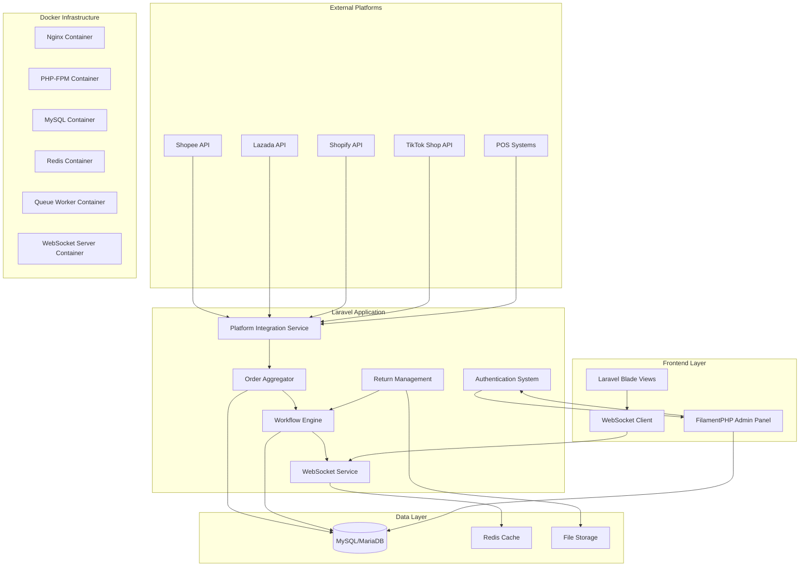

# Design Document

## Overview

The Multi-Platform Order Management System is a Laravel-based application that centralizes order processing from multiple e-commerce platforms (Shopee, Lazada, Shopify, TikTok) with real-time WebSocket communication, FilamentPHP administrative interface, and a flexible workflow engine for custom business processes. The system uses MySQL/MariaDB for data persistence and provides comprehensive order lifecycle management from acceptance to fulfillment and returns.

## Architecture

### System Architecture



### Technology Stack

- **Backend Framework**: Laravel 12
- **Database**: MySQL/MariaDB
- **Cache**: Redis
- **Admin Interface**: FilamentPHP v4
- **Real-time Communication**: Laravel WebSockets / Pusher
- **Frontend**: Laravel Blade with Alpine.js
- **Queue System**: Laravel Queues with Redis driver
- **File Storage**: Laravel Storage (local/S3)
- **Containerization**: Docker with Docker Compose
- **Web Server**: Nginx (containerized)
- **Process Manager**: Supervisor (for queues and WebSocket server)

## Components and Interfaces

### 1. Platform Integration Service

**Purpose**: Manages connections and data synchronization with external e-commerce platforms.

**Key Classes**:
- `PlatformConnector` (Abstract base class)
- `ShopeeConnector extends PlatformConnector`
- `LazadaConnector extends PlatformConnector`
- `ShopifyConnector extends PlatformConnector`
- `TikTokConnector extends PlatformConnector`
- `PlatformCredentialManager`

**Interfaces**:
```php
interface PlatformConnectorInterface
{
    public function authenticate(array $credentials): bool;
    public function fetchOrders(Carbon $since = null): Collection;
    public function updateOrderStatus(string $orderId, string $status): bool;
    public function validateCredentials(array $credentials): bool;
}
```

### 2. Order Aggregator

**Purpose**: Normalizes and consolidates orders from different platforms into a unified format.

**Key Classes**:
- `OrderAggregator`
- `OrderNormalizer`
- `OrderSyncManager`
- `PlatformOrderMapper`

**Core Methods**:
- `aggregateOrders()`: Fetches and processes orders from all platforms
- `normalizeOrder()`: Converts platform-specific order format to unified structure
- `detectDuplicates()`: Identifies potential duplicate orders across platforms

### 3. Workflow Engine

**Purpose**: Manages configurable business process flows for order processing.

**Key Classes**:
- `WorkflowEngine`
- `ProcessFlow`
- `WorkflowStep`
- `TaskAssignment`
- `WorkflowCondition`

**Workflow Configuration**:
```php
interface WorkflowEngineInterface
{
    public function createFlow(string $name, array $steps): ProcessFlow;
    public function executeStep(Order $order, WorkflowStep $step): bool;
    public function assignTask(WorkflowStep $step, User $user): TaskAssignment;
    public function evaluateConditions(Order $order, array $conditions): bool;
}
```

### 4. WebSocket Service

**Purpose**: Provides real-time communication for order updates and notifications.

**Key Classes**:
- `OrderUpdateChannel`
- `NotificationBroadcaster`
- `WebSocketEventHandler`

**Events**:
- `OrderReceived`
- `OrderStatusChanged`
- `WorkflowTaskAssigned`
- `ReturnRequested`

### 5. Authentication & Authorization

**Purpose**: Manages user access and permissions using Laravel's built-in authentication with FilamentPHP integration.

**Key Components**:
- Laravel Sanctum for API authentication
- FilamentPHP user management
- Role-based permissions using Spatie Laravel Permission
- Custom middleware for workflow task access

## Data Models

### Core Models

#### Order Model
```php
class Order extends Model
{
    protected $fillable = [
        'platform_order_id',
        'platform_type',
        'customer_name',
        'customer_email',
        'customer_phone',
        'total_amount',
        'currency',
        'status',
        'workflow_status',
        'order_date',
        'sync_status',
        'raw_data'
    ];
    
    protected $casts = [
        'raw_data' => 'json',
        'order_date' => 'datetime'
    ];
}
```

#### ProcessFlow Model
```php
class ProcessFlow extends Model
{
    protected $fillable = [
        'name',
        'description',
        'is_active',
        'conditions',
        'created_by'
    ];
    
    protected $casts = [
        'conditions' => 'json'
    ];
}
```

#### WorkflowStep Model
```php
class WorkflowStep extends Model
{
    protected $fillable = [
        'process_flow_id',
        'name',
        'step_order',
        'step_type',
        'assigned_role',
        'auto_execute',
        'conditions',
        'configuration'
    ];
    
    protected $casts = [
        'conditions' => 'json',
        'configuration' => 'json'
    ];
}
```

#### Platform Configuration Model
```php
class PlatformConfiguration extends Model
{
    protected $fillable = [
        'platform_type',
        'credentials',
        'sync_interval',
        'is_active',
        'last_sync'
    ];
    
    protected $casts = [
        'credentials' => 'encrypted:json',
        'last_sync' => 'datetime'
    ];
}
```

### Database Schema Design

**Key Tables**:
- `orders` - Main order storage
- `order_items` - Order line items
- `process_flows` - Workflow definitions
- `workflow_steps` - Individual workflow steps
- `task_assignments` - User task assignments
- `order_status_history` - Audit trail
- `platform_configurations` - API credentials and settings
- `return_requests` - Return management
- `billing_records` - Invoice and payment tracking

## Error Handling

### API Integration Errors
- **Connection Failures**: Retry mechanism with exponential backoff
- **Authentication Errors**: Automatic credential refresh where supported
- **Rate Limiting**: Queue-based request throttling
- **Data Validation Errors**: Comprehensive logging and admin notifications

### Workflow Errors
- **Step Execution Failures**: Automatic rollback and manual intervention options
- **Assignment Conflicts**: Priority-based task reassignment
- **Condition Evaluation Errors**: Fallback to manual processing

### Real-time Communication Errors
- **WebSocket Disconnections**: Automatic reconnection with message queuing
- **Broadcast Failures**: Fallback to database polling for critical updates

## Testing Strategy

### Unit Testing
- Platform connector authentication and data fetching
- Order normalization and validation logic
- Workflow engine step execution and condition evaluation
- WebSocket event broadcasting and handling

### Integration Testing
- End-to-end order synchronization from platforms
- Workflow execution across multiple steps and users
- Real-time notification delivery and client updates
- FilamentPHP admin interface functionality

### API Testing
- External platform API integration reliability
- POS system integration for billing operations
- WebSocket connection stability under load

### Performance Testing
- Order processing throughput with multiple platforms
- Database query optimization for large order volumes
- WebSocket concurrent connection handling
- FilamentPHP interface responsiveness with large datasets

## Docker Architecture

### Container Structure
- **app**: Laravel application with PHP-FPM
- **nginx**: Web server for serving static files and proxying PHP requests
- **mysql**: MySQL/MariaDB database server
- **redis**: Redis server for caching and queue management
- **queue**: Laravel queue worker for background job processing
- **websocket**: Laravel WebSocket server for real-time communication
- **scheduler**: Laravel task scheduler for automated operations

### Development vs Production
- **Development**: Single docker-compose.yml with all services
- **Production**: Separate containers with proper scaling and load balancing
- **Environment Variables**: Managed through .env files and Docker secrets

## Security Considerations

### Data Protection
- Encrypted storage of platform API credentials
- Secure transmission of order data between services
- Customer data anonymization for non-production environments
- Docker secrets for sensitive configuration data

### Access Control
- Role-based permissions for workflow tasks
- API rate limiting and request validation
- Audit logging for all order status changes and administrative actions
- Container isolation and network security

### Platform Integration Security
- OAuth 2.0 implementation where supported by platforms
- API key rotation and secure storage
- Request signing and validation for webhook endpoints
- Secure inter-container communication