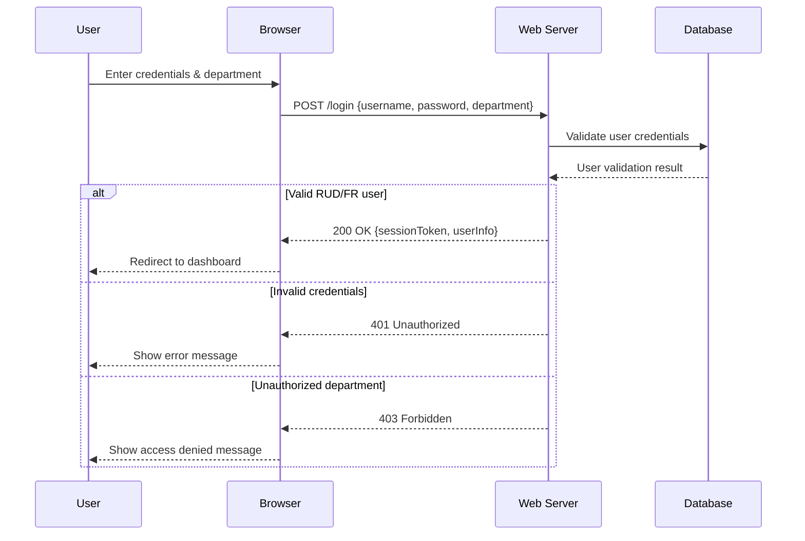
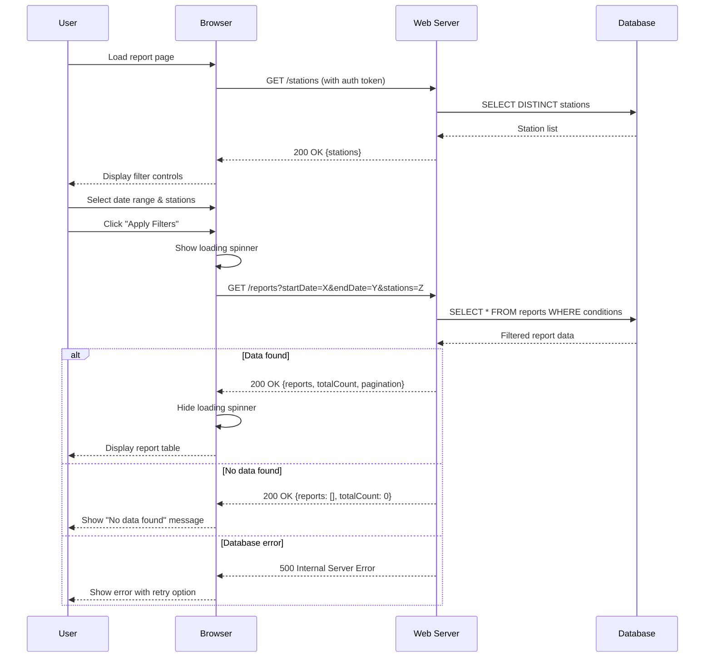
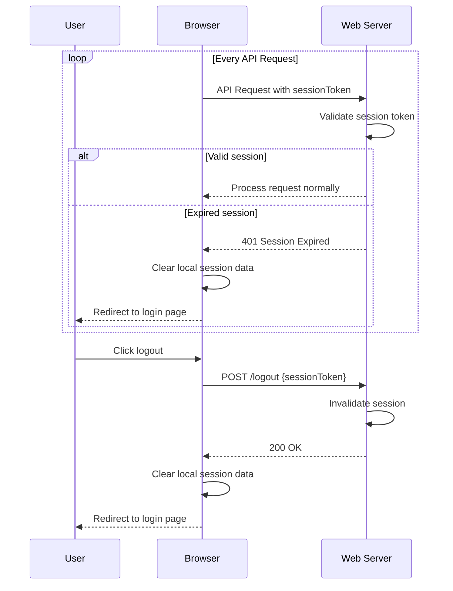
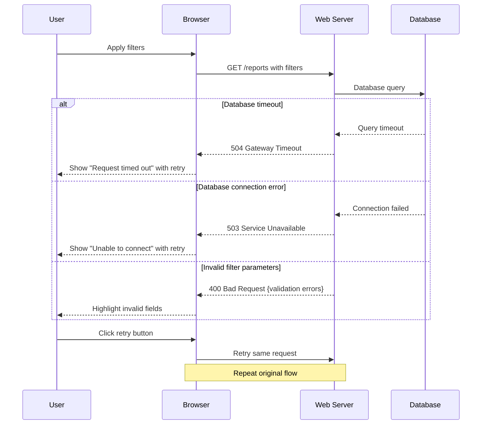

# Design Document

## Overview

The Database Report Display System is a web-based application that provides secure access to database reports for RUD and FR departments. The system features a clean HTML interface with date and station filtering capabilities, built with responsive design principles and department-based access control.

## Architecture

### System Architecture
```
┌─────────────────┐    ┌─────────────────┐    ┌─────────────────┐
│   Web Browser   │────│  Web Server     │────│    Database     │
│   (HTML/CSS/JS) │    │  (Auth + API)   │    │   (Reports)     │
└─────────────────┘    └─────────────────┘    └─────────────────┘
```

### Technology Stack
- **Frontend**: HTML5, CSS3, JavaScript (vanilla or lightweight framework)
- **Authentication**: Session-based or token-based authentication
- **Backend API**: RESTful API for data retrieval and filtering
- **Database**: SQL database with indexed date and station columns

## Sequence Diagrams

### User Authentication Flow


### Report Filtering and Display Flow


### Session Management Flow


### Error Handling Flow


## Components and Interfaces

### 1. Authentication Component
**Purpose**: Verify user credentials and department authorization

**HTML Structure**:
```html
<div class="login-container">
  <form class="login-form">
    <input type="text" id="username" placeholder="Username" required>
    <input type="password" id="password" placeholder="Password" required>
    <select id="department" required>
      <option value="">Select Department</option>
      <option value="RUD">Research & Development</option>
      <option value="FR">Finance & Reporting</option>
    </select>
    <button type="submit">Login</button>
  </form>
</div>
```

### 2. Filter Controls Component
**Purpose**: Provide date range and station selection interfaces

**HTML Structure**:
```html
<div class="filter-panel">
  <div class="date-filter">
    <label for="start-date">Start Date:</label>
    <input type="date" id="start-date" name="start-date">
    
    <label for="end-date">End Date:</label>
    <input type="date" id="end-date" name="end-date">
  </div>
  
  <div class="station-filter">
    <label for="station-select">Stations:</label>
    <select id="station-select" multiple>
      <!-- Options populated dynamically -->
    </select>
  </div>
  
  <div class="filter-actions">
    <button id="apply-filters">Apply Filters</button>
    <button id="clear-filters">Clear All</button>
  </div>
</div>
```

### 3. Report Display Component
**Purpose**: Present filtered database reports in tabular format

**HTML Structure**:
```html
<div class="report-container">
  <div class="report-header">
    <h2>Database Reports</h2>
    <span class="record-count">Showing <span id="count">0</span> records</span>
  </div>
  
  <div class="report-table-wrapper">
    <table class="report-table">
      <thead>
        <tr>
          <th>Date</th>
          <th>Station</th>
          <th>Data Field 1</th>
          <th>Data Field 2</th>
          <!-- Additional columns based on report structure -->
        </tr>
      </thead>
      <tbody id="report-data">
        <!-- Data rows populated dynamically -->
      </tbody>
    </table>
  </div>
  
  <div class="pagination">
    <button id="prev-page">Previous</button>
    <span id="page-info">Page 1 of 1</span>
    <button id="next-page">Next</button>
  </div>
</div>
```

### 4. Loading and Status Component
**Purpose**: Provide user feedback during operations

**HTML Structure**:
```html
<div class="status-container">
  <div class="loading-spinner" style="display: none;">
    <div class="spinner"></div>
    <span>Loading data...</span>
  </div>
  
  <div class="error-message" style="display: none;">
    <span class="error-text"></span>
    <button class="retry-button">Retry</button>
  </div>
  
  <div class="no-data-message" style="display: none;">
    <span>No data found for the selected criteria.</span>
  </div>
</div>
```

## Data Models

### User Authentication Model
```javascript
{
  username: string,
  department: "RUD" | "FR",
  sessionToken: string,
  loginTime: timestamp
}
```

### Filter Criteria Model
```javascript
{
  dateRange: {
    startDate: "YYYY-MM-DD",
    endDate: "YYYY-MM-DD"
  },
  stations: [string], // Array of station IDs
  pagination: {
    page: number,
    limit: number
  }
}
```

### Report Data Model
```javascript
{
  records: [
    {
      date: "YYYY-MM-DD",
      station: string,
      // Additional data fields based on database schema
    }
  ],
  totalCount: number,
  currentPage: number,
  totalPages: number
}
```

## CSS Design System

### Color Scheme
- Primary: #2563eb (Blue)
- Secondary: #64748b (Slate)
- Success: #059669 (Green)
- Warning: #d97706 (Orange)
- Error: #dc2626 (Red)
- Background: #f8fafc (Light Gray)
- Text: #1e293b (Dark Gray)

### Typography
- Headers: 'Segoe UI', Tahoma, Geneva, Verdana, sans-serif
- Body: 'Segoe UI', Tahoma, Geneva, Verdana, sans-serif
- Monospace: 'Courier New', Courier, monospace

### Layout Structure
```css
.main-layout {
  display: grid;
  grid-template-areas: 
    "header header"
    "filters content"
    "status content";
  grid-template-columns: 300px 1fr;
  grid-template-rows: auto auto 1fr;
  min-height: 100vh;
}
```

## Error Handling

### Authentication Errors
- Invalid credentials: Display "Invalid username or password" message
- Unauthorized department: Display "Access denied. Contact administrator."
- Session timeout: Redirect to login with "Session expired" message

### Data Loading Errors
- Database connection failure: Display retry option with "Unable to connect to database"
- Query timeout: Display "Request timed out. Please try again."
- No data found: Display "No records match your criteria" with suggestion to adjust filters

### Validation Errors
- Invalid date range: Highlight fields and show "End date must be after start date"
- No filters selected: Show warning "Please select at least one filter criterion"

## Testing Strategy

### Unit Testing
- Filter validation functions
- Date range calculation logic
- Authentication state management
- Data formatting utilities

### Integration Testing
- API endpoint connectivity
- Database query execution with filters
- Authentication flow end-to-end
- Filter application and data refresh

### User Interface Testing
- Responsive design across devices
- Filter control interactions
- Table sorting and pagination
- Loading states and error displays

### Security Testing
- Department access restrictions
- Session management
- SQL injection prevention
- Cross-site scripting (XSS) protection

## Performance Considerations

### Frontend Optimization
- Minimize DOM manipulations during data updates
- Implement virtual scrolling for large datasets
- Use CSS Grid/Flexbox for efficient layouts
- Optimize images and assets

### Backend Optimization
- Database indexing on date and station columns
- Query result caching for common filter combinations
- Pagination to limit data transfer
- Connection pooling for database access

### Loading Strategy
- Progressive loading of filter options
- Lazy loading of report data
- Background refresh capabilities
- Optimistic UI updates
